# How do fibers works? 

## Fiber

From [Fabio Labella—How do Fibers Work? A Peek Under the Hood](https://www.youtube.com/watch?v=x5_MmZVLiSM)

other link [systemfw](https://systemfw.org/archive.html)

用stack实现了fiber

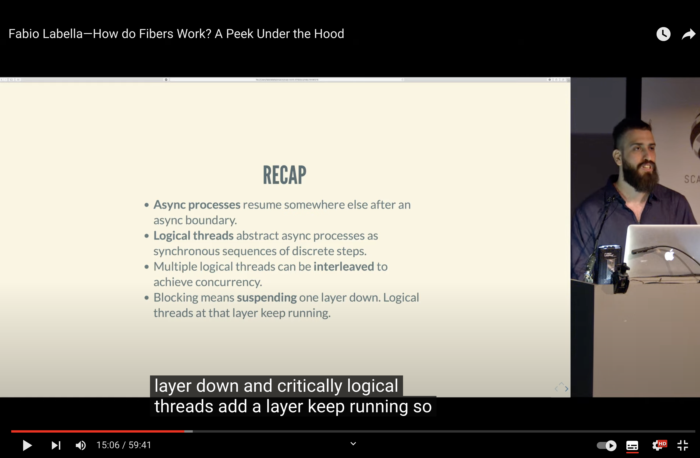
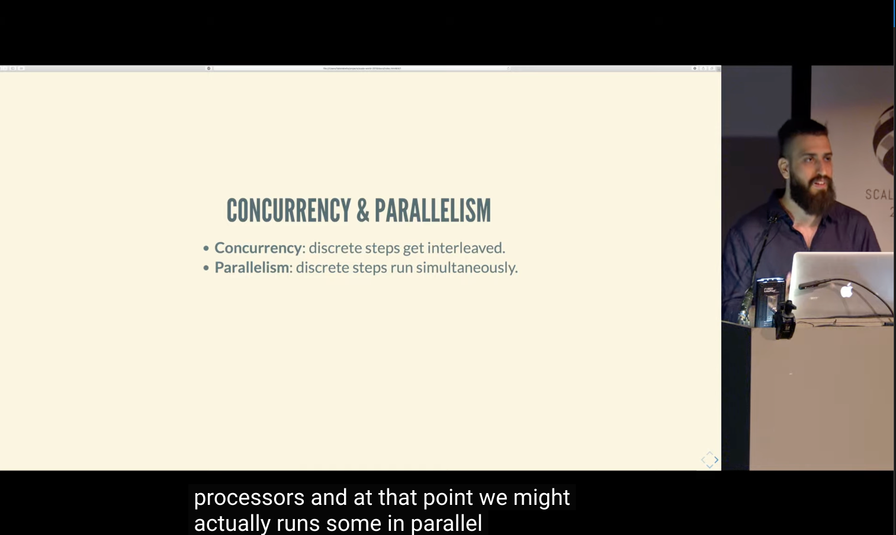
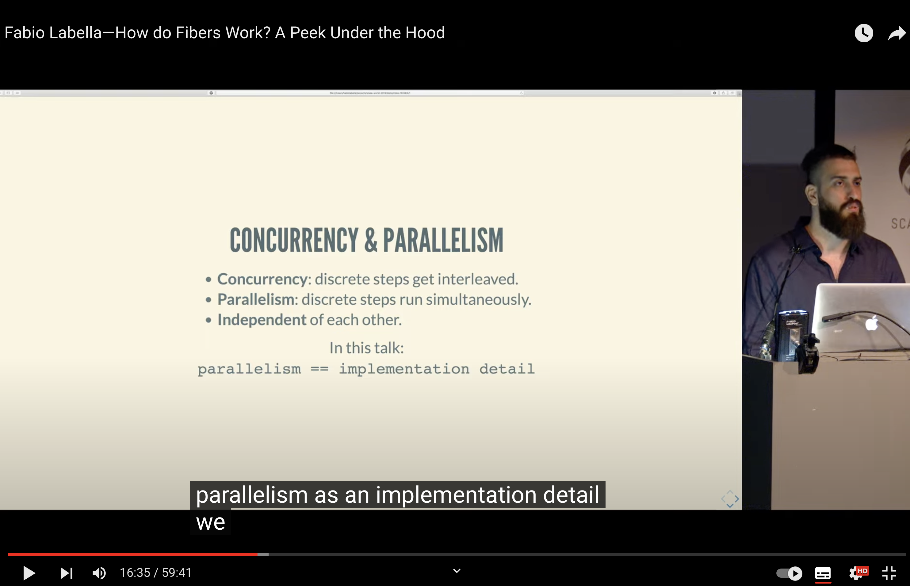
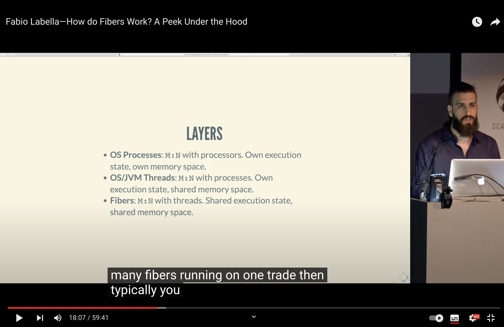
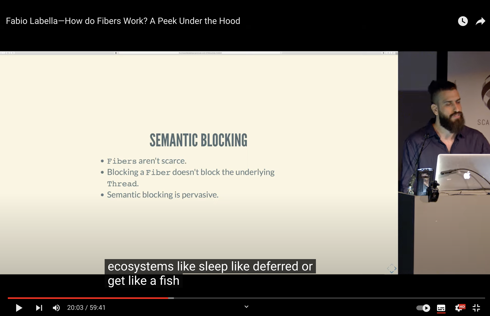
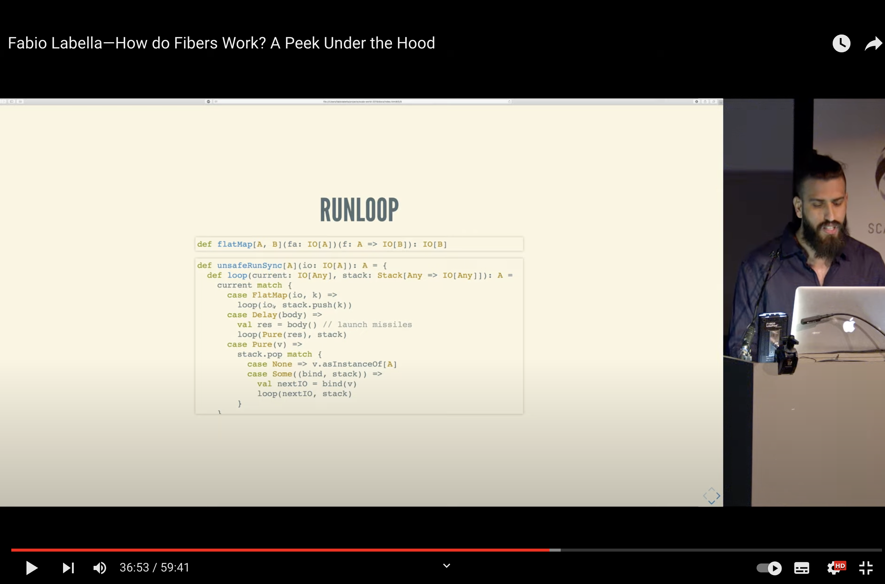
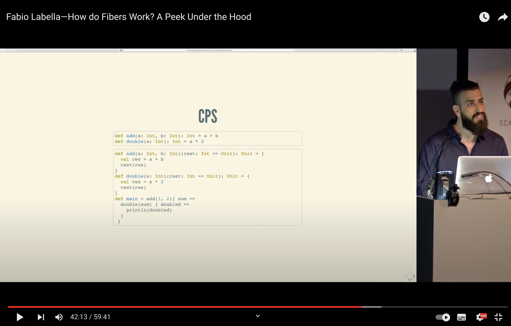
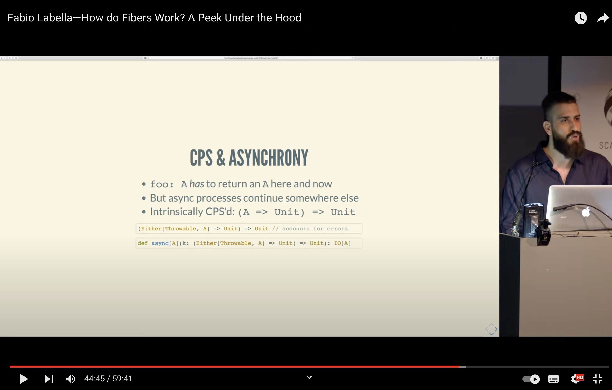
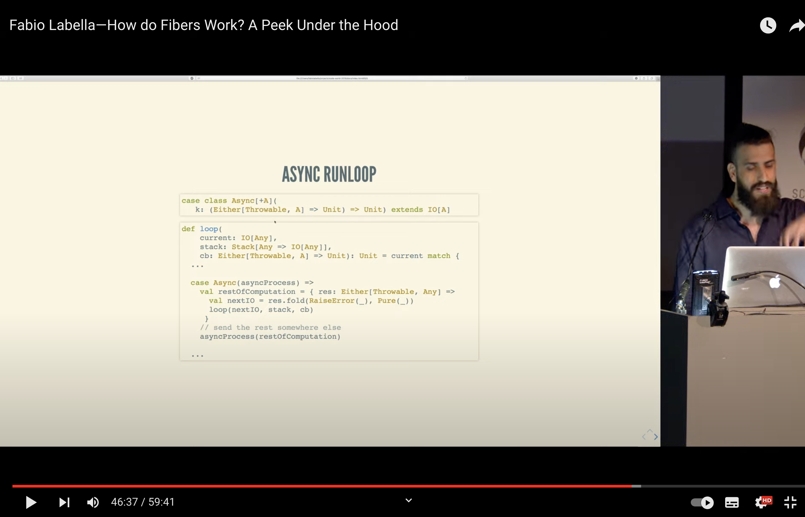
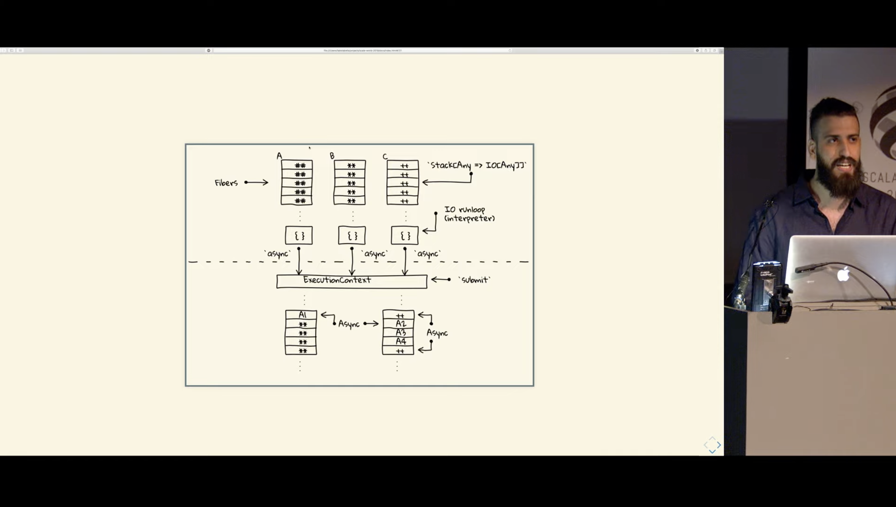

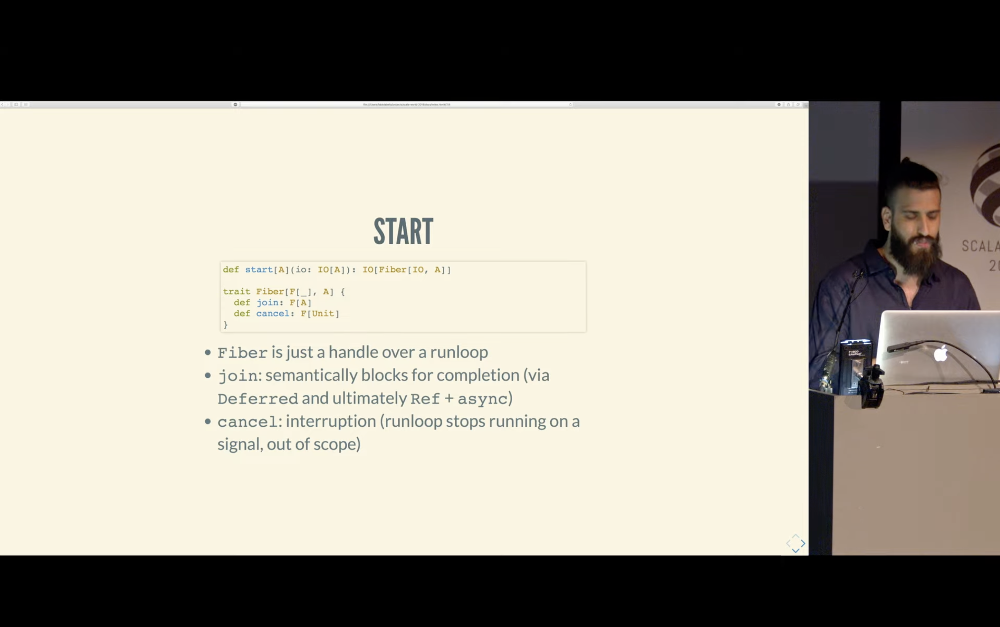
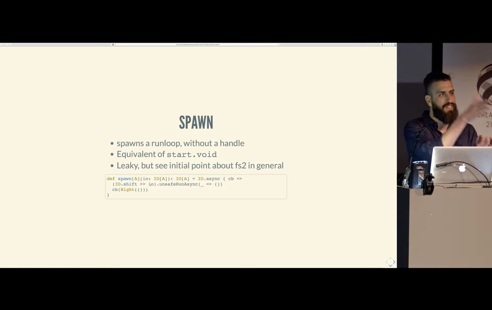
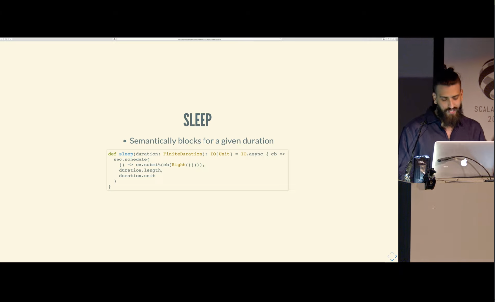