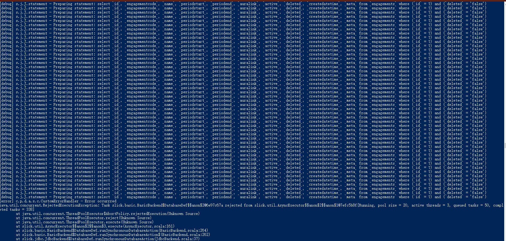

# Slick query overflow

## Query overflow
User report a bug for table can't be displayed:

There is something wrong with the get api

Console
: 

Console log
: @@snip [Console log](./code/consolelog.txt)

So it's seems the query triggered too many query to database, more than the database configuration.

## Code implement

let see how is the query implemented? 

@@snip [query](./code/query.scala)

With database configuration:

@@snip [DB setting](./code/db.conf)

So we could easily know the inner query has triggered 50 query in queue of database setting,
then the query failed

Let's see more clear about the get query:

Request
: 

Requet test
: @@snip [Request test](./code/request.txt)

In this get query, set the page size to 2147483647.

## How to fix?

### Fix it by reduce inner query:

Add new query
: @@snip [Add new query](./code/dbquery.scala)

Query Refined
: @@snip [Query refine](./code/queryRefined.scala)

Console result
: @@snip [Console result](./code/queryRefinedResult.txt)

### Fix by reduce the inner number query by pageNumber

The inner query is triggered by the outer pageNumber, in practical way of page query, there should not set the number 
to the number [pageSize=214748364]. And also increase the database queue size.

