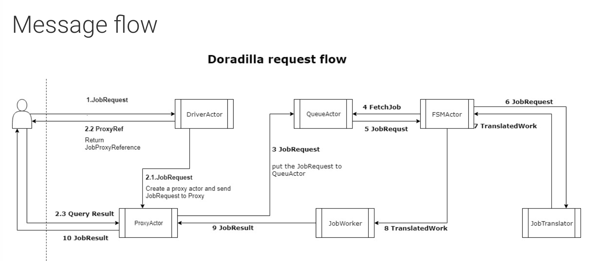
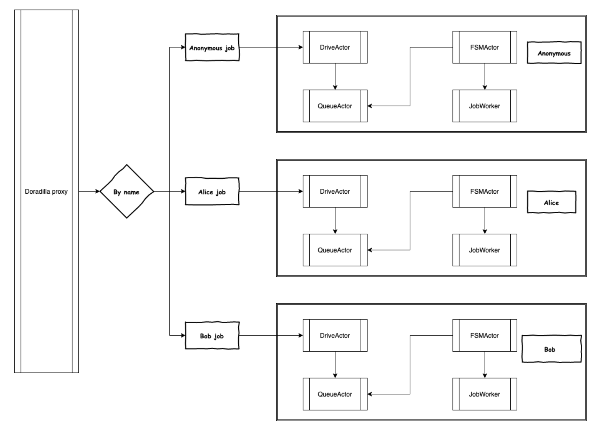

## Doradilla design

### [Message flow](https://wherby.github.io/doradilla/introduction/messageflow.html)

### [JobApi design](https://wherby.github.io/doradilla/usage/index.html)

Code implementation for JobApi: 
 Named-job api is need after anonymous api is released.

Anonymous processor call

: @@snip[Anonymous call](../code/PorcessApi.scala)

Named job call

: @@snip[Named job call](../code/NamedJobApi.scala)

Use in AWM

: @@snip[AWM usage](../code/AWMcall.scala)

Use in CIDR

: @@snip[CIDR usage](../code/CIDRcall.scala)