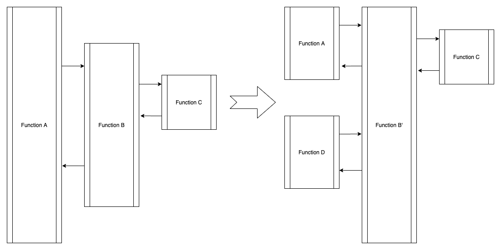

## What're challenges of software development?

### About lock


[Lock in Java](https://wherby.github.io/the-tao-in-program-language/)

[Implementation of lock](https://wherby.github.io/Pessimists-file-lock/)

### How to change wheels when driving?




What's function in the developer's view?

```scala
 val fx = A => B
```

 or  

```scala
 def fx(par1:Any, par2:Any,...):Any ={
   doA(par1)
   if(par2){
     doB(par2)
   }
 }
```

For example:

We need to query price data with business logic which is not confirmed by LoS people:

GetByEngagementName

: @@snip[Query by engagementId](../code/GetEngagementSecurityPrice.scala)

GetBySecuritypriceAndOrder

: @@snip[Query By businessLogic](../code/Getsecuritypriceorder.scala)

QeuryData

: @@snip[Query data with different function](../code/QueryDate.scala)

QueryInDatabase

: @@snip[Query in database](../code/QueryInDatabase.scala)


