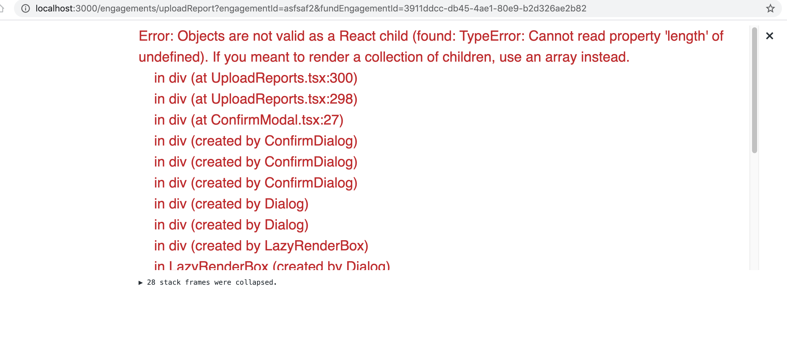
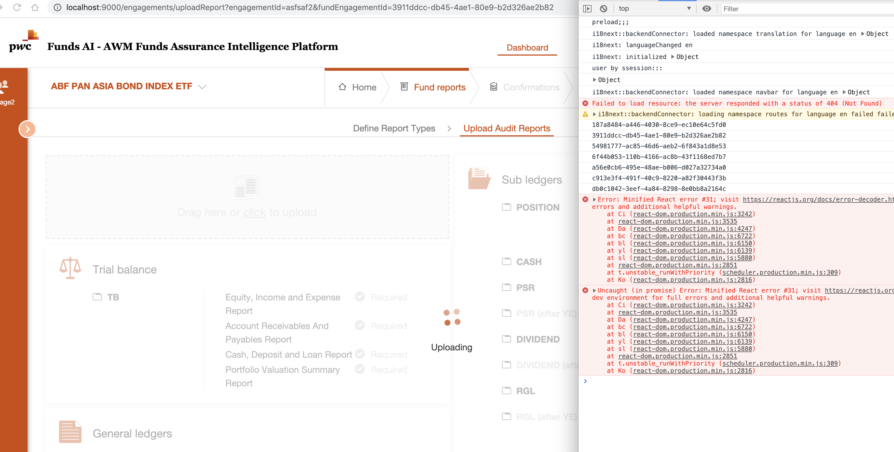
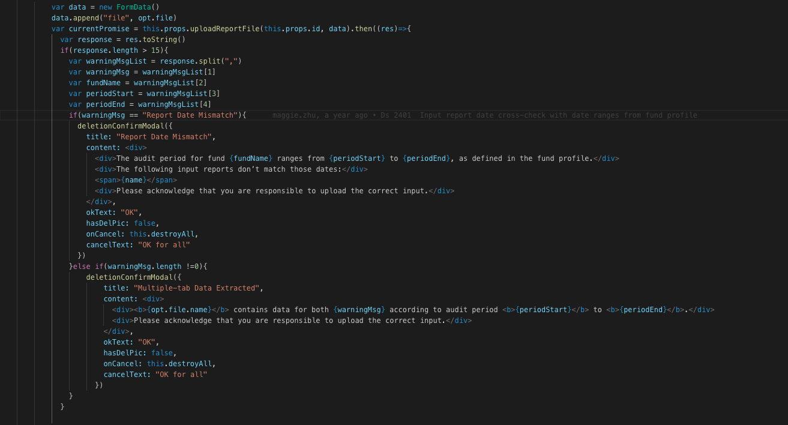

# Timeout errors and crash

## Error in dev

In project, when return value is :
```scala
 Ok("Extract Success")
```
The result will crush when return value changes to:
```scala
Ok("Extraction Success")
```
In dev environment, the UI will crash:



while in prod environment, the UI will not crash, but spin will not stop:



For the crash is different in dev and prod environment, let's see the cause code in front-end:



## Gateway timeout

When running long job in rest api. there will throw 502 gateway timeout from nginx. 
There are two main causes:

1. nginx timeout setting[default is 90s](https://serverfault.com/questions/777749/how-to-disable-timeout-for-nginx)

```yaml
server{
   ...
   proxy_read_timeout 300;
   proxy_connect_timeout 300;
   proxy_send_timeout 300; 
   ...
}
```

2. play server for idle timeout[default is 85s](https://stackoverflow.com/questions/44873117/why-does-play-2-6-close-a-websocket-after-85-seconds-when-it-is-idle-while-play)

```yaml
play.server.http.idleTimeout = 180s
```
