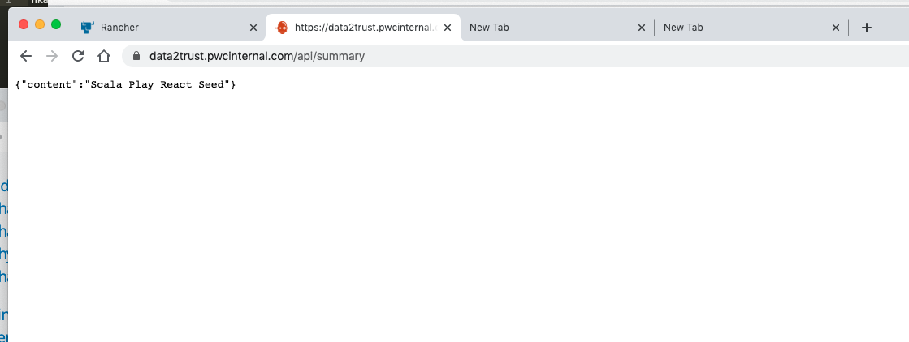
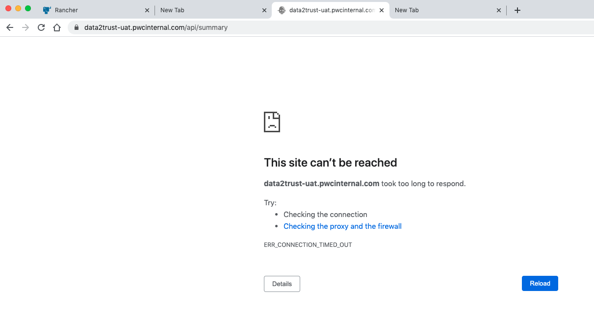
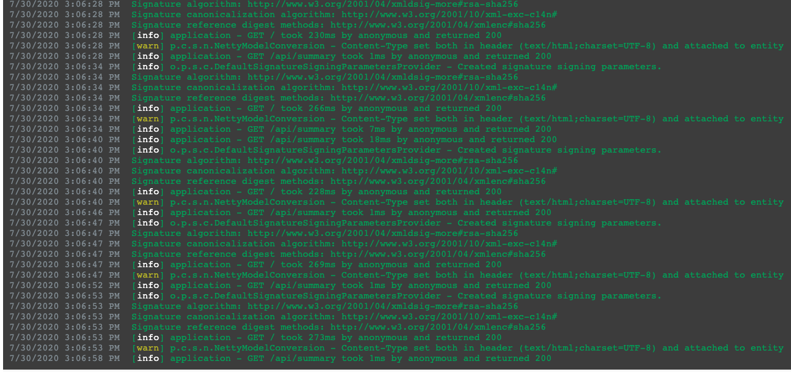
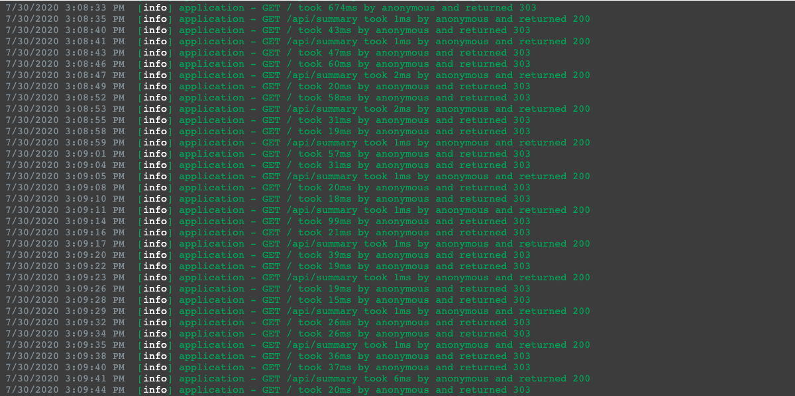

# Upgrade issue for authentication

## Health check setting issue

In AWM project, code upgrade with new authentication method from SAML2 to OpenID.
The upgrade is successfully applied in QA environment; but in UAT environment, all API calls to application
are lost.

Api call success in QA:

But api call failed in UAT:

What's different with QA and UAT in network architecture?

In QA environment, there is only one standalone server for application, api call could go directly to the application.

In UAT environment, there are two servers for application, and nginx server to proxy api calls to the application servers,
and a network load balancer for nginx server.

On network load balancer for nginx,  there is health check for application setting to "/" which is the root path of the
application.

Route config
: @@snip[Route conf](code/route.conf)

Because the root path is secured by authentication method, when user visit root path, user will redirect to 
authentication site for user login.

When using SAML2, when health check hit root path, with return 200:

When using OpenId, when health check hit root path, with return code 303:

So when upgrade from SAML2 to OpenId, the return code is change from 200 to 303, then the network 
load balancer will block all traffic to the application.

